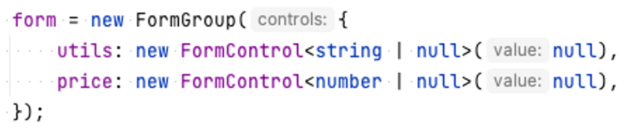
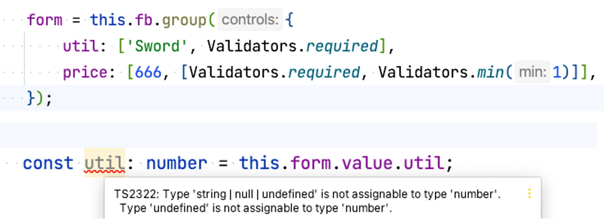
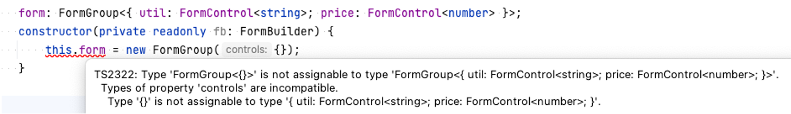
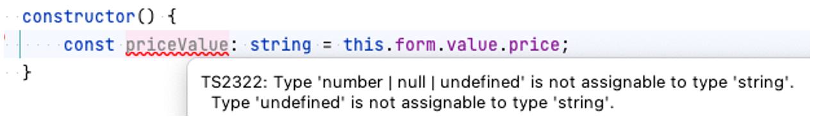
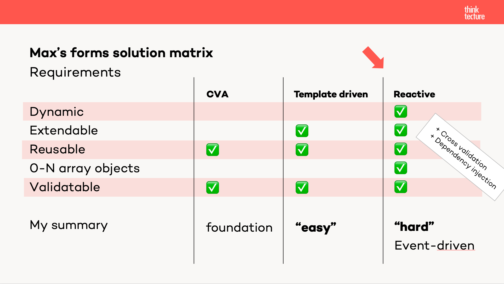

In this article we will explore how to create and structure complex and dynamics forms with Angular. 
For that we will discuss how Forms work in Angular, and what is behind the scenes of them. We will use various APIs provided by Angular to structure, route, nest and extend a given form.
We will use different approaches and techniques creating a stateful and routed stepper.

## Setting scene

Why should we care and learn how to create complex forms?
Well, obviously at some point they are inevitable. Imaging a car manufacturer that provides a way to configure your car. There are too many options, features, and combinations to write everything down in one form.
Let’s not forget cross-field constrains, group validation and fields that depend on values of other fields. 
It is not just with such large forms; even small forms can profit from feature richness and some architecture behind the scenes. How nice it is to be guided through something, only care about the important thing in each step. By delaying some information and requests we can make the information easier to comprehend – isn’t that what a guide should do, then why not create such a “guide” with our forms? 

Let’s start at the beginning, what APIs does Angular provide? 

### Different kind of forms, Template Driven and Reactive Forms	

Angular brings its own form-system in two flavors, Reactive Forms and Template Driven Forms.
While Template Driven forms are mainly declarative – like we are used from HTML forms – the reactive forms are imperative and most distinguishable reactive. In this context reactive means, that we once setup controls, streams and observables and react to input from there on. In theory we would not have to use a submit button to save, send or handle the input data, we could simply react to every input like we wanted to. 
The good news is, that Angular provides both version with the same basic API approach. It provides us with different ‘FormControl’ interfaces that are internally used by Angular to connect with the HTML interface itself. We don’t have to worry about the connection – even if we write our own custom controls and inputs. 

Let’s check out some APIs.

## Angualr's Forms API

Explaining Angulars forms APIs is best started at the very bottom. All of Angulars Forms consist of different inheritances of the `AbstractControl` interface. That interface is used, so that its implementations, provide information about the states like dirty, valid and its value. Moreover, it also adds basic functionality to its descendents, e.g. a value change observer and basic error handling. 
Most commonly we don’t care about what specific implementation we are dealing with. While using a form we ask if they are valid or not and what their value is. However, when setting up a form it is crucial to differentiate. 

The implementations are FromControl, FormGroup, FromArray and FormRecord, from which the FormControl is the most atomic.
Reactive Forms and Template Driven Froms share the same underlying system, but in this article we will focus on the Reactive Forms implementation. 
Before checking the API let’s discuss the newly introduced type-system for Angular’s reactive forms.

### Angulars reactive form typing 

Angular introduced a typed form API with version 14. The updated API derives the field, group and array typed from the definition. You can either use a FormBuilder or declare the 
objects using a matching constructor.






Angular add the types `null` and `undefined` to the derived type to stay true to its HTML counterpart. If a control is disabled the value will be undefined.

 

If a from is reset, the values will be null. You can change that behavior by using the NonNullableFormBuilder or the UntypedFormBuilder. You could even provide the matching option to a FormBuilder or the constructor logic.

The newly introduced FormRecord class, serves the same purpose as the already known FormGorup, but with one major difference. When using the FormGroup you must know all controls and type beforehand. By using the FormRecord you can skip the definition of FormControls, if you know that all controls will have the same type.

Angulars forms API is the same for typed and untyped reactive froms (besides the derived type). Let’s begin looking at the APIs starting with the Basic FormControl.


### FomControl API

A FormControl is any element that is directly interacted with. It can be an input field, toggle, slider and more – even custom elements. A FormControl should describe only a single value and value type. The documentation defines it as:

>	Tracks the value and validation status of an individual form control.

Grouping different Controls together is best done by using a FormGroup, FormArray or the newly introduced FormRecord. Starting with the FormGroup we can create object-like structures. 


### FormGroup

Using FormGroups to structure  and group FromControls is one of Angulars standart way of doing so programatically. FormGroups implement the AbstractFormControl interface and add some more functionality. For example, to retrieve the value of multiple controls and add validators to a group and thereby to validate multiple controls which depend on each other.
Single controls are added into an object like structure and can be retrived via a getter function ` someFormGorup.get(‘controlNameA’)`or by using the member access e.g. ` someFormGorup.controls.controlNameA`.
The getter function also resolves complex paths like `someFormGorup.get(‘subGroup.controlNameB’)`. Further the official documentation defines FormGroup as such:

> Tracks the value and validity state of a group of FormControl instances.

### FormRecord

The introduced class FormRecord serves the same prupos as a FormGroup, but witch one difference. It does not care how many controls you add to it, or how they are named. It Only cares about their types. Every control inside a FormRecord must have the same underlying type. 

### FormArray

Sometimes you don’t want to provide key, instead you want to add a abriatarry number of controles of the same type. Think of some items (coins, collectables, etc.), you don’t know how many there will be just that they all share the same information. 
That is a use case for an array. Angulars FormArray is exactly that, an array containing FormControls. Just remember: An FromControl could be another array, a FormGroup or Record or just a basic FormControl input.

### Non-Type matching controls

From time to time, especially with dynamic and complex forms, it is possible that none of the described controls matches the type that you want to use. 

-	A FormGroup must know about the control names, their types and how many there are
-	A FormRecord must know about the control types, and all controls must have the same type
-	A FormArray, same as the FormRecords, assumes that all controls share the same type

Therefore, if you want to use typed reactive forms with Angular, you must at least know what types there will be and how they are structured. 


Know that we know of the basic Angular-Form building blocks, let’s see how to use them. 

### Binding Controls
Angular’s rective forms can be connected to the template by using two different ways. The first way is to reference the FormControls name inside a group or ID inside an array. 

``` html
// CODE FORMCONTROL NAME BINDING
<fieldset class="field">
  <label>Last Name</label>
  <input type="text" formControlName="lastName" placeholder="Peterson" autocomplete="disabled"/>
</fieldset>
``` 

The second way is to bind the control directly using it as input. 

```html
// CODE CONTROL AS INPUT 
<tt-person-details [personGroup]="form"></tt-person-details>
```

The difference here is that you must resolve and reference each control individually in the second approach. While the resolving is done by Angular by Angular using the name reference. Angular will give you an exception when it cannot resolve a name referenced in the template. 

Know that we took discussed the given APIs, lets head over on how to creat nested, complex and dynamic forms. Starting with the implantation of a basic custom input with the control value accessor.

### FormControl nesting 

### Implementing the Control Value Accessor – CVA

Angulars Control Value Accessor, or short CVA, is the way to go to create custom FormControl components. It is best used in an atomic fashion, therefore, a component implementing the CVA should only serve one purpose. Think of a slider, calendar, toggle and so on. The Smart- and Presentational-Components architecture is a good starting point. The interface CVA interface provides us with four methods to implement. 

1.	`writeValue(object: any): void;`
2.	`registerOnChange(fn: any): void;`
3.	`registerOnTouched(fn: any): void;`
4.	`setDisabledState(isDisabled: boolean);`

Each method is necessary for the ControlContainer to connect to the control. With these methods it can display information about the controls state as well as update and receive its value. 
The register functions hand over callbacks, so that all interactions are tight and without memory leaks on destroying or creating controls.


While this is made for simple values and small components, it could receive all kind of objects, simple or complex as you like. It would integrate with all forms but would have to manage everything internally and therefore we would gain anything by it. 
What other and better approaches are there for complex objects and values? We already discussed FormGroups, Arrays and Records, let’s see how we can manage to nest them. 

### Control Container injection
When building large, complex, or dynamic forms we reach a point where we must think about nesting different ControlContainer like FormGroups and FormArrays. 
On one hand we could simply pass a reference via an @Input to another component, on the other hand we could leverage Angulars Dependency Injection mechanics. 
As the first variant seems simpler and more straightforward it comes with multiple drawbacks. We would have to think about @Input variable names, we would build chains of Container Inputs and even more we would be forced to reference each child in the parent template where we want to nest it.
That may be an option if your form only contains a small number of possible variants, but for larger system or where the end is unknown the dependency injection is the preferred way to go. 

Dependency injection enables us to build loosely coupled components and with that also forms. You can inject any component, service or directive that is defined upwards of the current component you are in. Upwards means in this context, upwards in the DOM or in case of a service in the definition order (think of modules, the root context or component providers). 

```html
// parent including the component below
  <form [formGroup]="form" (submit)="submit()">
    <router-outlet></router-outlet>
  </form>

```

That enables us, to inject exactly the context we need. We could for example simply inject the parent component, that holds the form definition.

```typescript
export class StepThreeComponent implements OnInit, CanDeactivateStepper {
    ...
    constructor(
        @Optional() private readonly stepperComponent: StepperComponent,
        private readonly fb: UntypedFormBuilder
    ) {}

    ngOnInit(): void {
        this.parent = this.stepperComponent?.form;
        const fromParent = this.parent?.get('stepThree');
        ....
    }
    ...
}
```

Or even better, we inject the ControlContainer that holds all information and is component independent. Because of this independence we can write truly reusable components that slot them self into existing forms. 

The only important thing to remember ist, that you need a directive that provides this container. But rember, a `FormGroup` is exactly that and it also provides us with this interface. The only step left undone is to retrieve the actual FormGroup control and reference it internally in our nested component. 

```typescript
export class StepTwoComponent implements OnInit, CanDeactivateStepper {
    ...
    constructor(private readonly controlContainer: ControlContainer) {}

    ngOnInit(): void {
        // at least some knowlegde or expectation is required
        this.form = this.controlContainer.control as UntypedFormGroup;
    }
}
``` 

With that everything is connected. Looking at the demo application, you will see these two approaches (injecting a distinct parent, injecting the ControlContainer) in action in step two and three. 

Providing the different solutions to nesting forms, or even better FormControls, there should also be a guide with which you can choose, what form type and solution you can use. 

## Conclusion: My forms solution matrix

Below you see a boild down version of my solution approach to forms. With all the information about forms and Angulars form APIs this should help you decide on what approach to use. As a rule of thumb you could say: "The more complex the requirement, the more likley you should use reactive forms".


